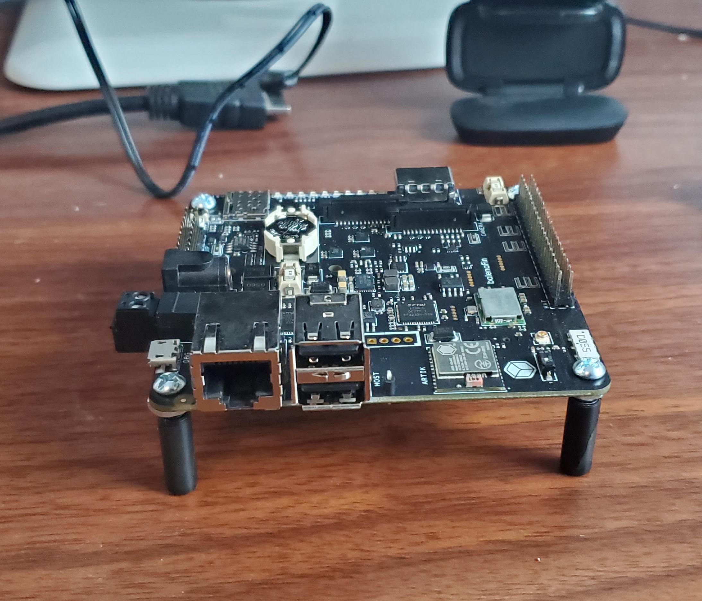
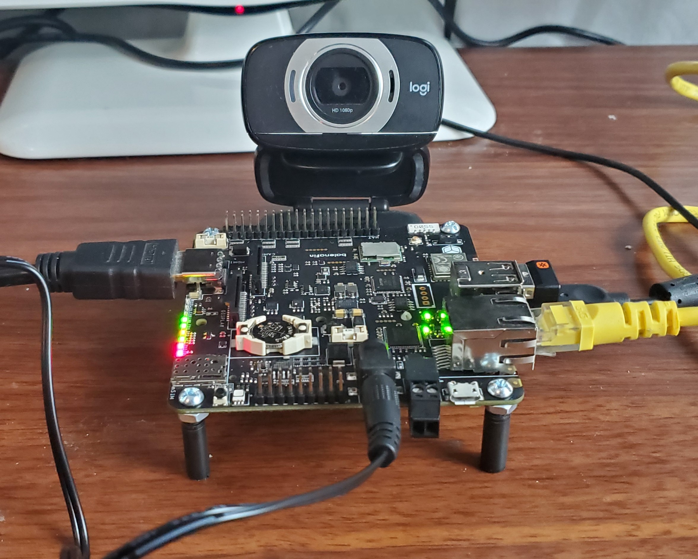
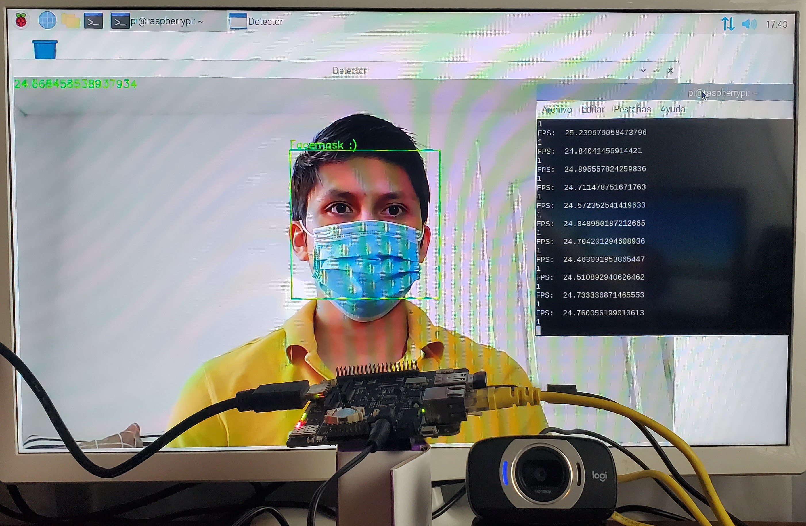

# BalenaFin-Facemask-Detector

BalenaFin board-based face mask detector.

# Table of contents

- [BalenaFin-Facemask-Detector](#balenafin-facemask-detector)
- [Table of contents](#table-of-contents)
  - [Introduction](#introduction)
- [Materials](#materials)
- [Diagram](#diagram)
- [Setup](#setup)
- [Training](#training)
- [Testing](#testing)
- [Demo](#demo)

## Introduction

The Covid19 pandemic has been an event that has affected not only the life of each person, but the coexistence of people in all aspects of life and one of these aspects has clearly been the way in which all people coexist.

One of the main measures to combat the pandemic is use a face mask.

I want to create a EDGE face mask detector BalenaFin board-based.

# Materials

List the hardware and software you will use to build this.

Hardware: 
- BalenaFin.
- USB Camera.

Software: 
- Python 3.8. 

Libraries:

- [OpenCV. ](https://opencv.org/)
- [TensorFlow Lite Interpreter. ](https://www.tensorflow.org/lite/guide/python)

# Diagram

# Setup

All the information about the BalenaFin will be in this link:

https://www.balena.io/fin/

The operating system that was installed on the BalenaFin was Raspberry OS:

https://www.raspberrypi.org/downloads/raspberry-pi-os/

NOTE: The code was made to work with the raspberry's built-in camera.

To install the libraries except TFlite Interpreter:
    sudo apt-get install libatlas-base-dev python3-opencv

To install TFlite Interpreter:

    pip3 install https://dl.google.com/coral/python/tflite_runtime-2.1.0.post1-cp37-cp37m-linux_armv7l.whl

HW Setup:

# Training

To train the model, a Notebook in Google Colab is used in order to facilitate the training of the model.

(Click on the image to open the notebook)
)

NOTE: the code for the training already contains the command to download the dataset on the Google Colab platform, however, here is the link to Kaggle and Github.

- Github: [Link](https://github.com/altaga/BalenaFin-Facemask-Detector/tree/main/Train/facemask-dataset)
- Kaggle: [Link](https://www.kaggle.com/altaga/facemaskdataset)

# Testing

To run the model in BalenaFin, run this code on the command line.

    python3 main.py

Model running:

<kbd>

</kbd>

# Demo

Video: Click on the image:

Sorry github does not allow embed videos.

* [Table of contents](#table-of-contents)